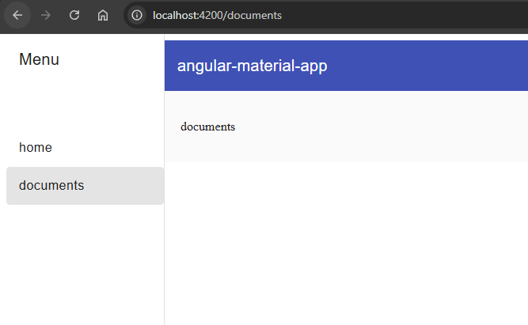
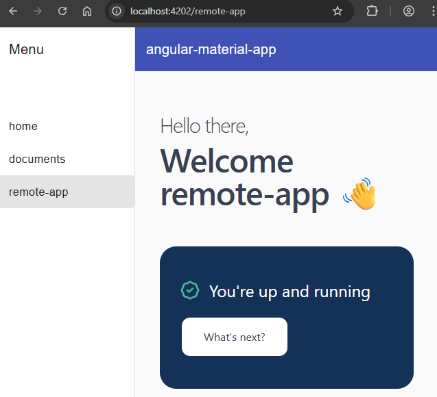

# app-nf
This is a prototype app based on native federation V3


## PreInstall

```sh
nvm use 22.19.0
```

## Run

### shell

In docker
```sh
docker compose up --build 
```

http://localhost:4200/




### remote-app

preinstall
```sh
npm i
```

single (dev mode)
```sh
npm run start
```

http://localhost:4202/


OR

in shell (dev mode)
```sh
npm i
npm run start:proxy
```




http://localhost:4203/
